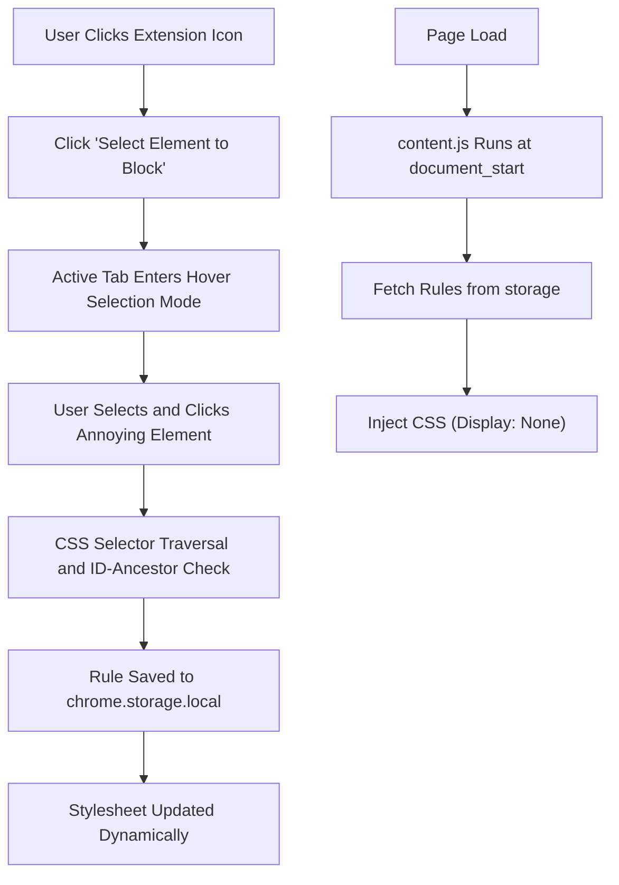

# ClickBlock: Chrome Ad & HTML Element Remover 🛡️

ClickBlock is a lightweight, localization-ready, privacy-centric Google Chrome extension (Manifest V3) that empowers users to permanently hide any unwanted elements, ads, banners, or popups on any webpage. Just click to block, and the extension automatically remembers and hides them on your next visit.

---

## 🌟 Key Features

* **Visual Element Selector**: Toggle selection mode, hover to highlight any element with a dashed red border, and click to remove it instantly.
* **Flicker-Free Hiding (`document_start`)**: Blocked elements are injected as a custom dynamic stylesheet before the DOM compiles, preventing layout shifts and annoying ad-flashing.
* **Precision Rule Generator**: Combines class names, elements, and tag indexes (`:nth-of-type`) and halts climbing early upon encountering unique parent IDs to build highly specific and robust selectors.
* **Rules Portability (Backup & Restore)**: Export your block lists to a JSON file and import them on other devices or share them with friends.
* **Fully Localized**: English and Traditional Chinese (`zh_TW`) support out of the box.
* **Zero-Tracking Privacy**: Utilizes only the `storage` permission. No external API calls, tracking cookies, or remote script execution.

---

## 🛠️ How It Works



### 1. The Selector Traversal Algorithm
To prevent rules from breaking on dynamic web layouts, ClickBlock climbs up the DOM tree and generates a specific path:
* **Unique ID Halt**: If any parent element has a unique ID, the generator stops traversing up and uses it as a root selector (e.g. `#sidebar-left > nav > div:nth-of-type(2)`), keeping selectors short and resilient.
* **Precise `nth-of-type`**: Identifies the 1-based child order relative to siblings of the same element name.

### 2. Fast CSS Injection
Unlike basic blockers that wait for the page to load and then hide elements using JavaScript (causing layout jumping), ClickBlock reads storage and injects `<style>` blocks immediately on `document_start` so ads never paint on your screen.

---

## 📂 Project Directory Structure

```text
Chrome-AdBlocker/
├── _locales/                   # Localization dictionaries
│   ├── en/messages.json        # English translation
│   └── zh_TW/messages.json     # Traditional Chinese translation
├── icons/                      # Extension icons for Chrome Store (16, 32, 48, 128px)
├── content.js                  # Document start stylesheet injector & selection script
├── generate_icons.ps1          # PowerShell automation to compile custom canvas icons
├── manifest.json               # Extension configuration (Manifest V3)
├── popup.html                  # Popup control interface
├── popup.js                    # Popup controllers & i18n renderer
└── README.md                   # Project documentation
```

---

## 🚀 Installation (Developer Mode)

To run this extension locally:
1. Clone this repository or download the source code:
   ```bash
   git clone https://github.com/bobble1118/Chrome-AdBlocker.git
   ```
2. Open Google Chrome and navigate to `chrome://extensions/`.
3. In the top-right corner, toggle the **Developer mode** switch to **ON**.
4. Click the **Load unpacked** (載入未封裝項目) button in the top-left.
5. Select the folder containing `manifest.json`.

---

## 📖 Usage Guide

1. **Hide an Element**:
   * Click the **ClickBlock** icon in your toolbar.
   * Click **Select Element to Block**.
   * Hover over the element you want to remove (highlighted in red) and click.
2. **Restore / Manage Rules**:
   * Click the **ClickBlock** icon.
   * You will see a list of CSS rules applied to the current domain.
   * Click the **`×`** icon next to a rule to delete it and restore the element.
3. **Backup & Sync**:
   * Click **Export Rules** to save a backup JSON.
   * Click **Import Rules** on another computer to sync your settings.

---

## 📜 License

This project is open-source and available under the [MIT License](LICENSE).
